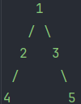

# 🔍 DFS & BFS 탐색 알고리즘 정리

## 📌 DFS (Depth-First Search, 깊이 우선 탐색)

- **탐색 방식**: 한쪽 끝까지 쭉 파고든 후 더 이상 갈 곳이 없으면 되돌아와서(=백트래킹) 다른 경로 탐색
- **사용 자료구조**: `Stack` (또는 재귀)
- **구조**: LIFO (Last In, First Out)

### ✅ 특징
- 깊은 곳부터 탐색
- 경로 추적(백트래킹)에 유용
- 미로찾기, 퍼즐, 조합 등에서 사용됨

### ✅ 예시 순서
그래프 구조:


DFS 탐색 순서: 1 → 2 → 4 → 3 → 5


### 📚 비유
> 책 더미에서 맨 위 책을 먼저 꺼내는 것 → 가장 마지막에 넣은 것부터 탐색

---

## 📌 BFS (Breadth-First Search, 너비 우선 탐색)

- **탐색 방식**: 현재 노드에서 가까운 이웃 노드를 모두 탐색한 후, 다음 레벨로 이동
- **사용 자료구조**: `Queue`
- **구조**: FIFO (First In, First Out)

### ✅ 특징
- 가까운 곳부터 탐색
- 최단 거리 탐색에 유리
- 거리 기반 문제에 자주 사용됨

### ✅ 예시 순서
그래프 구조


BFS 탐색 순서: 1 → 2 → 3 → 4 → 5


### 🎫 비유
> 놀이공원 입장 줄처럼 먼저 온 순서대로 처리 → 넓게 퍼지며 탐색

---

## 📊 DFS vs BFS 비교표

| 항목         | DFS (깊이 우선)                | BFS (너비 우선)                |
|--------------|-------------------------------|-------------------------------|
| 자료구조     | Stack 또는 재귀               | Queue                         |
| 순서 구조    | LIFO (후입선출)                | FIFO (선입선출)               |
| 탐색 방식    | 깊게 → 백트래킹               | 가까운 곳부터 차례로 탐색     |
| 장점         | 백트래킹, 경로 추적에 유리     | 최단 거리, 레벨 탐색에 유리   |
| 대표 활용    | 미로, 퍼즐, 조합, 백트래킹     | 최단 거리, 레벨 탐색 문제     |

---

## ✨ 요약

> ✅ DFS = 스택 = 깊이 우선 탐색  
> ✅ BFS = 큐 = 너비 우선 탐색

---

## 💡 코드 예시

<details>
<summary>DFS (Stack 사용)</summary>

```java
Stack<Integer> stack = new Stack<>();
stack.push(start);
visited[start] = true;

while (!stack.isEmpty()) {
    int current = stack.pop();
    for (int i = 0; i < graph.length; i++) {
        if (!visited[i] && graph[current][i]) {
            visited[i] = true;
            stack.push(i);
        }
    }
}
```   
</details>

<details> <summary>BFS (Queue 사용)</summary>

```java
Queue<Integer> queue = new LinkedList<>();
queue.offer(start);
visited[start] = true;

while (!queue.isEmpty()) {
    int current = queue.poll();
    for (int i = 0; i < graph.length; i++) {
        if (!visited[i] && graph[current][i]) {
            visited[i] = true;
            queue.offer(i);
        }
    }
}
```
</details> 