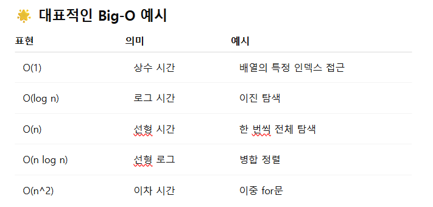
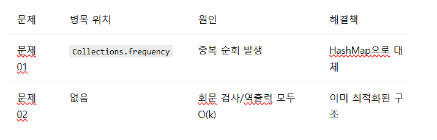

작성자: 장형준

✨ 목차

시간 복잡도란?

Big-O 표기법의 개념 및 예시

RoadToBiodome01 시간 복잡도 분석

RoadToBiodome02 시간 복잡도 분석

병목 현상 분석 및 최적화 방안

보너스 과제: 최적화 비교 분석

1. ⏱️ 시간 복잡도란?

시간 복잡도는 알고리즘이 입력 크기에 따라 얼마나 많은 연산을 수행하는지를 나타내는 지표다. 프로그램의 실행 시간을 수학적으로 표현할 수 있게 해 주며, 최악, 평균, 최선의 실행 시간 중 보통 "최악의 시간"을 기준으로 표현한다.

필요성:

효율적인 알고리즘 선택

성능 개선

대규모 데이터 처리 판단

2. 🔄 Big-O 표기법 개요

Big-O 표기법은 입력 크기 n이 증가할 때 수행 시간의 상한을 나타내는 표현이다.

🌟 대표적인 Big-O 예시

3. RoadToBiodome01 시간 복잡도 분석

핵심 로직 요약

문자열을 정리하여 숫자 리스트로 변환

Collections.frequency()를 이용해 특정 숫자가 몇 번 나왔는지 체크

주요 반복문:

for (int val : list) {
if (Collections.frequency(list, val) == 1)

복잡도 분석

Collections.frequency(list, val)는 내부적으로 list를 전체 순회하기 때문에 O(n)

바깥 for문도 n회 반복 → O(n^2)

병목 포인트

중첩 루프가 O(n^2)을 초래함

🔧 개선 방안

Map<Integer, Integer>를 사용하여 등장 횟수를 O(n)으로 미리 세자

개선 예시 (핵심만):

Map<Integer, Integer> countMap = new HashMap<>();
for (int val : list) {
countMap.put(val, countMap.getOrDefault(val, 0) + 1);
}
// 이후 1회 등장한 값 찾기

개선된 시간 복잡도: O(n)

4. RoadToBiodome02 시간 복잡도 분석

핵심 로직 요약

입력 문자열을 띄어쓰기 기준으로 나누고

각 단어가 회문인지 검사 → 회문이면 그대로 출력, 아니면 역순 출력

주요 루프:

for (int i = sens.length - 1; i >= 0; i--) {
for (int e = 0; e < word.length() / 2; e++) {
if (word.charAt(e) != word.charAt(word.length() - 1 - e))

복잡도 분석

n: 단어 수, k: 단어 평균 길이

회문 검사: O(k) → 단어 수만큼 반복 → O(nk) = O(N) (전체 문자 수 기준)

회문이 아닌 경우 역순 출력도 O(k)

병목 없음

입력 길이 자체가 최대 10^6이므로, **O(N)**은 충분히 효율적임

5. 🚧 병목 현상 및 최적화 방안

6. 🎉 보너스 과제: 시간 복잡도 최적화 비교

문제01 기존: O(n^2)

중첩 탐색으로 인해 느림

문제01 개선: O(n)

HashMap으로 단일 루프 처리 → 대폭 향상

문제02: O(n)

단어 단위로 문자열 길이만큼만 처리 → 변경 불필요

📅 참고자료

https://www.bigocheatsheet.com/

https://visualgo.net/en

https://www.geeksforgeeks.org/collections-frequency-java/

✅ 요약

시간 복잡도는 알고리즘 효율성을 판단하는 중요한 도구

문제01은 최적화 여지가 컸고, 문제02는 구조적으로 효율적이었음