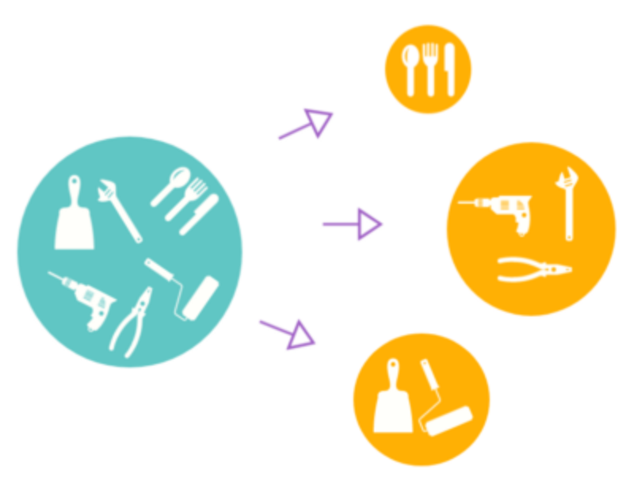
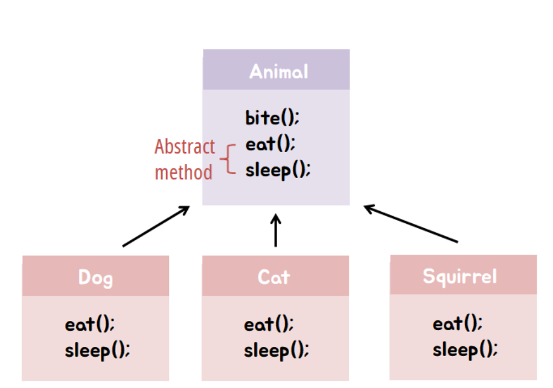
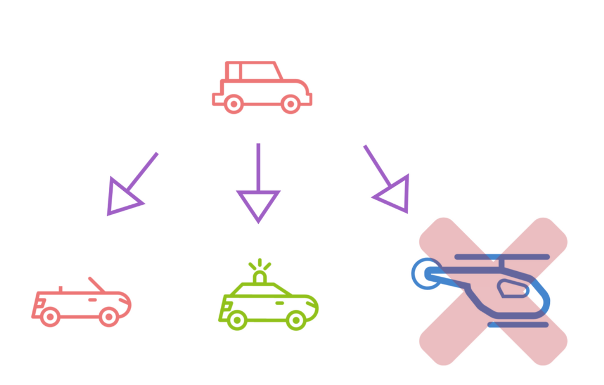
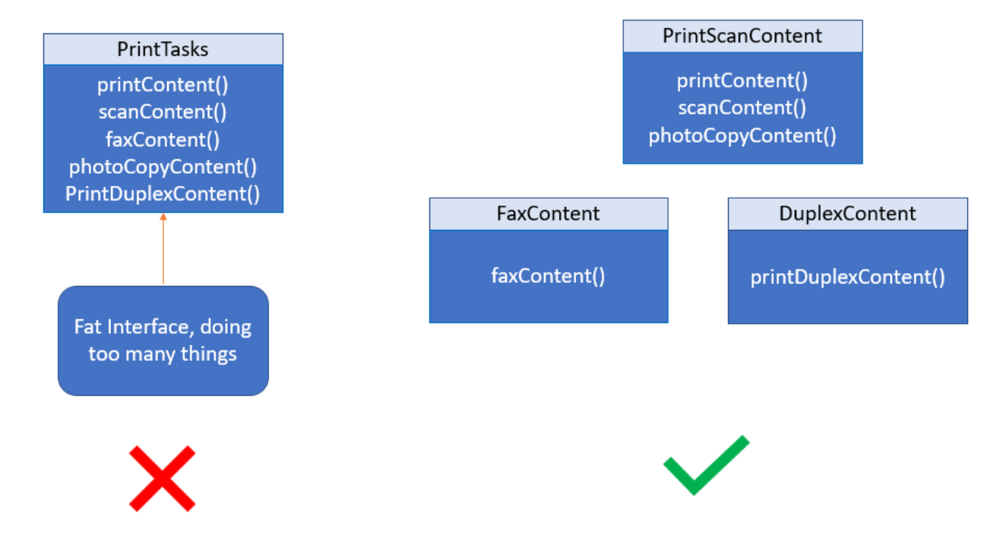
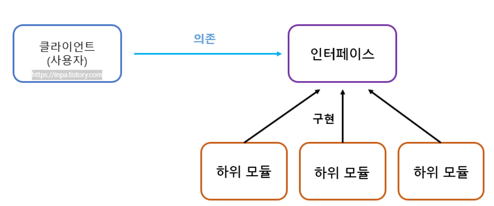

SOLID 다섯 가지 원칙 개념
1. SRP: 단일 책임 원칙 (Single Responsibility Principle)
   하나의 클래스는 하나의 책임만 가져야 한다.
    변경 사유가 하나뿐이어야 한다.

2. OCP: 개방-폐쇄 원칙 (Open/Closed Principle)
   클래스는 확장에 대해 열려 있어야 하고, 수정에는 닫혀 있어야 한다.

3. LSP: 리스코프 치환 원칙 (Liskov Substitution Principle)
   자식 클래스는 부모 클래스의 기능을 대체할 수 있어야 한다.

상속받은 클래스는 부모의 행위를 해치지 않아야 한다.

4. ISP: 인터페이스 분리 원칙 (Interface Segregation Principle)
   클라이언트는 자신이 사용하지 않는 메서드에 의존해서는 안 된다.

    큰 인터페이스보다는 여러 개의 구체적인 인터페이스가 낫다.

5. DIP: 의존 역전 원칙 (Dependency Inversion Principle)
   고수준 모듈은 저수준 모듈에 의존해서는 안 되며, 추상화에 의존해야 한다.

SOLID 객체 지향 원칙을 적용하면 코드를 확장하고 유지 보수 관리하기가 더 쉬워지며, 불필요한 복잡성을 제거해 리팩토링에 소요되는 시간을 줄임으로써 프로젝트 개발의 생산성을 높일 수 있다.

참고로 SOLID 는 어떠한 특정 프로그래밍 언어 혹은 프레임워크를 위해 만든 원칙이 아니다 .

단일 책임 원칙 - SRP (Single Responsibility Principle)

단일 책임 원칙은 클래스(객체)는 단 하나의 책임만 가져야 한다는 원칙
여기서'책임'이라는 의미는 하나의 '기능 담당'으로 보면 된다.
즉,하나의 클래스는 하나의 기능 담당하여 하나의 책임을 수행하는데 집중되도록 클래스를 따로따로 여러개 설계하라는 원칙이다.
만일 하나의 클래스에 기능(책임)이 여러개 있다면 기능 변경(수정) 이 일어났을때 수정해야할 코드가 많아진다.예를 들어 A를 고쳤더니 B를 수정해야하고 또 C를 수정해야하고, C를 수정했더니 다시 A로 돌아가서 수정해야 하는, 마치 책임이 순환되는 형태가 되어버린다.따라서 SRP 원칙을 따름으로써 한 책임의 변경으로부터 다른 책임의 변경으로의 연쇄작용을 극복할 수 있게 된다.
최종적으로 단일 책임 원칙의 목적은프로그램의 유지보수 성을 높이기 위한설계 기법이다.
이때 책임의 범위는 딱 정해져있는 것이 아니고, 어떤 프로그램을 개발하느냐에 따라 개발자마다 생각 기준이 달라질 수 있다. 따라서 단일 책임 원칙에 100% 해답은 없다.

            Tip
            예를들어 청소기 클래스는 청소 메소드만 잘 구현하면 되지 화분에 물을 주고 드라이 까지 할 책임은 없다.물론 다재다능한 청소기는 좋아보이지만, 만일 청소기가 고장나면 다른 기능까지도 사용을 못해지기 때문이다.즉, 청소기는 청소만 잘하면 된다는 책임만 가지면 된다.쉽게 말해 하나의 클래스로 너무 많은 일을 하지 말고 딱 한 가지 책임만 수행하라는 뜻으로 보면 된다.
개방 폐쇄 원칙 - OCP (Open Closed Principle)

OCP 원칙은 클래스는 '확장에 열려있어야 하며, 수정에는 닫혀있어야 한다' 를 뜻한다.
기능 추가 요청이 오면 클래스를 확장을 통해 손쉽게 구현하면서, 확장에 따른 클래스 수정은 최소화 하도록 프로그램을 작성해야 하는 설계 기법이다.

[ 확장에 열려있다 ] - 새로운 변경 사항이 발생했을 때 유연하게 코드를 추가함으로써 큰 힘을 들이지 않고 애플리케이션의 기능을 확장할 수 있음
[ 변경에 닫혀있다 ] - 새로운 변경 사항이 발생했을 때 객체를 직접적으로 수정을 제한함. 

어렵게 생각할 필요없이, OCP 원칙은 추상화 사용을 통한 관계 구축을 권장을 의미하는 것이다.
즉, 다형성과 확장을 가능케 하는 객체지향의 장점을 극대화하는 기본적인 설계 원칙

            Tip
            어렵게 생각할 필요없이, 우리가 자바 프로그래밍을 배우면서 사용한 추상 클래스와 상속을 통환 클래스 관계 구축을 말하는 것이다.

리스코프 치환 원칙 - LSP (Liskov Substitution Principle)

LSP 원칙은 서브 타입은 언제나 기반(부모) 타입으로 교체할 수 있어야 한다는 원칙이다.
쉽게 말하면 LSP는 다형성 원리를 이용하기 위한 원칙 개념으로 보면 된다.
간단히 말하면 리스코프 치환 원칙이란, 다형성의 특징을 이용하기 위해 상위 클래스 타입으로 객체를 선언하여 하위 클래스의 인스턴스를 받으면, 업캐스팅된 상태에서 부모의 메서드를 사용해도 동작이 의도대로 흘러가야 하는 것을 의미하는 것이다.
따라서 기본적으로 LSP 원칙은 부모 메서드의 오버라이딩을 조심스럽게 따져가며 해야한다.왜냐하면 부모 클래스와 동일한 수준의 선행 조건을 기대하고 사용하는 프로그램 코드에서 예상치 못한 문제를 일으킬 수 있기 때문이다.

            Tip
            자바에선 대표적으로 Collection 인터페이스를 LSP의 예로 들수있다.Collection 타입의 객체에서 자료형을 LinkedList에서 전혀 다른 자료형 HashSet으로 바꿔도 add() 메서드를 실행하는데 있어 원래 의도대로 작동되기 때문이다.한마디로 다형성 이용을 위해 부모 타입으로 메서드를 실행해도 의도대로 실행되도록 구성을 해줘야 하는 원칙이라 이해하면 된다.
Collection<String> myData = new LinkedList<>();
myData.add("apple");
myData.add("banana");

myData = new HashSet<>();
myData.add("apple");
myData.add("banana");
이 코드에서 myData는 Collection이라는 부모 타입이지만
LinkedList나 HashSet처럼 전혀 다른 자료구조로 교체해도 .add() 같은 메서드는 잘 작동해요.

Collection은 부모 인터페이스

LinkedList, HashSet은 자식 클래스
→ 둘 다 add()를 오버라이딩해서 원래 기대한 대로 작동하게 만들었기 때문에 문제가 없는 것

인터페이스 분리 원칙 - ISP (Interface Segregation Principle)

ISP 원칙은 인터페이스를 각각 사용에 맞게 끔 잘게 분리해야한다는 설계 원칙이다.
SRP 원칙이클래스의 단일 책임을 강조한다면, ISP는인터페이스의 단일 책임을 강조하는 것으로 보면 된다.
즉, SRP 원칙의 목표는 클래스 분리를 통하여 이루어진다면, ISP 원칙은 인터페이스 분리를 통해 설계하는 원칙.
ISP 원칙은 인터페이스를 사용하는 클라이언트를 기준으로 분리함으로써, 클라이언트의 목적과 용도에 적합한 인터페이스 만을 제공하는 것이 목표이다.
다만 ISP 원칙의 주의해야 할점은한번 인터페이스를 분리하여 구성해놓고나중에 무언가 수정사항이 생겨서 또 인터페이스들을 분리하는 행위를 가하지 말아야 한다. (인터페이스는 한번 구성하였으면 왜만해선 변하면 안되는 정책 개념)

            Tip
            인터페이스는 제약 없이 자유롭게 다중 상속(구현)이 가능하기 때문에, 분리할 수 있으면 분리하여 각 클래스 용도에 맞게 implements 하라는 설계 원칙이라고 이해하면 된다.

의존 역전 원칙 - DIP (Dependency Inversion Principle)

DIP 원칙은 어떤 Class를 참조해서 사용해야하는 상황이 생긴다면, 그 Class를 직접 참조하는 것이 아니라 그 대상의 상위 요소(추상 클래스 or 인터페이스)로 참조하라는 원칙
쉽게 이야기해서 구현 클래스에 의존하지 말고, 인터페이스에 의존하라는 뜻
의존 관계를 맺을 때 변화하기 쉬운 것 또는 자주 변화하는 것보다는, 변화하기 어려운 것 거의 변화가 없는 것에 의존하라는 것

            Tip
            의존 역전 원칙의 지향점은 각 클래스간의 결합도(coupling)을 낮추는 것이다.
