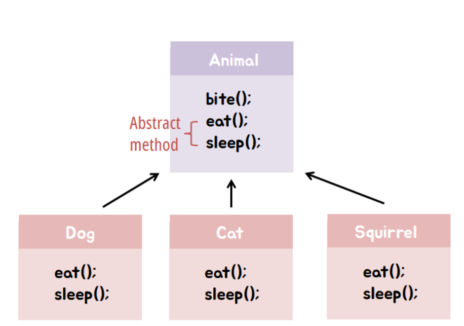
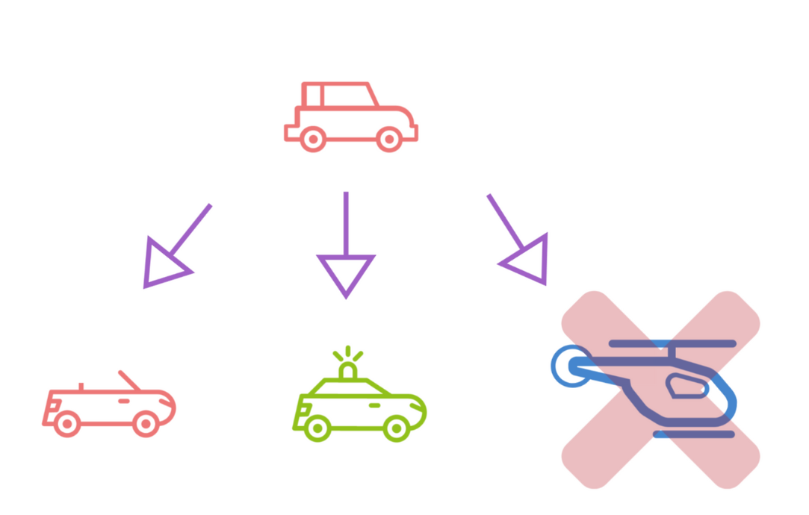
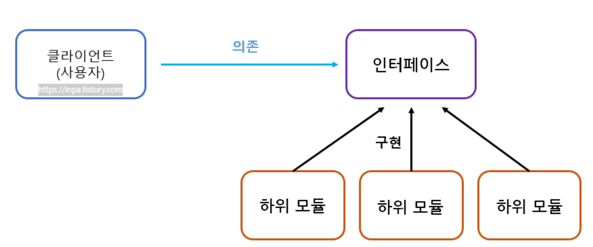

# SOLID 객체 지향 원칙 정리

---

## 📌 SOLID 원칙이란?

> 객체지향 설계 5대 원칙으로, 유지보수성과 확장성을 높이고 코드의 복잡도를 줄이기 위한 설계 지침.

**핵심 요약**: SOLID 원칙은 "변화에 유연하고 유지보수하기 쉬운 코드"를 위한 기본 철학이며, 특정 언어나 프레임워크에 종속되지 않는다.

---

## 1. SRP: 단일 책임 원칙 (Single Responsibility Principle)

> **한 클래스는 한 가지 책임(기능)만 가져야 한다.**

하나의 클래스에 여러 책임이 있으면, 한 기능의 변경이 다른 기능에 영향을 줄 수 있다. 책임을 분리하면 변경의 파급효과를 줄이고 유지보수성이 높아진다.

### 📷 개념 설명 이미지

* 

### 💡 Tip

> 청소기는 청소만 잘하면 된다. 화분에 물 주고 드라이 기능까지 넣으면 고장 시 모두 못 쓴다. 하나의 클래스는 한 가지 책임만!

### ✅ 간단한 예시

```java
public class ReportGenerator {
    public String generate() {
        return "Report 내용";
    }
}

public class ReportPrinter {
    public void print(String report) {
        System.out.println(report);
    }
}
```

---

## 2. OCP: 개방-폐쇄 원칙 (Open/Closed Principle)

> **클래스는 확장에는 열려 있어야 하고, 수정에는 닫혀 있어야 한다.**

변화가 생길 때 기존 코드를 수정하지 않고 기능을 추가할 수 있도록 구조를 만들어야 한다. 추상화(인터페이스/상속)를 통해 유연하게 확장 가능하다.

### 📷 개념 설명 이미지

* 

### 💡 Tip

> 추상 클래스를 만들고, 기능은 상속으로 확장하자. 기존 코드는 그대로 두고 새로운 클래스만 추가해서 확장하자.

### ✅ 간단한 예시

```java
interface Payment {
    void pay();
}

class CardPayment implements Payment {
    public void pay() {
        System.out.println("카드 결제 진행");
    }
}

class OrderService {
    private Payment payment;
    public OrderService(Payment payment) {
        this.payment = payment;
    }
    public void checkout() {
        payment.pay();
    }
}
```

---

## 3. LSP: 리스코프 치환 원칙 (Liskov Substitution Principle)

> **자식 클래스는 부모 클래스를 대체할 수 있어야 한다.**

다형성을 활용할 때, 부모 클래스로 선언된 객체를 자식 객체로 바꾸어도 원래 의도대로 동작해야 한다.

### 📷 개념 설명 이미지

* 

### 💡 Tip

> 자바의 Collection 인터페이스는 대표적인 예. LinkedList에서 HashSet으로 바꿔도 `.add()`가 의도대로 작동한다.

### ✅ 간단한 예시

```java
Collection<String> myData = new LinkedList<>();
myData.add("apple");
myData = new HashSet<>();
myData.add("banana");
```

* 부모 타입: Collection
* 자식 클래스: LinkedList, HashSet
* 둘 다 add()를 오버라이딩하여 정상 동작 → LSP 만족

---

## 4. ISP: 인터페이스 분리 원칙 (Interface Segregation Principle)

> **클라이언트는 자신이 사용하지 않는 인터페이스에 의존해서는 안 된다.**

큰 인터페이스 하나보다는 여러 개의 작은 인터페이스로 나누어, 필요한 기능만 구현하도록 한다.

### 📷 개념 설명 이미지

* 

### 💡 Tip

> 인터페이스는 필요 기능만 분리해 다중 구현 가능하니, 기능마다 쪼개서 용도에 맞게 구현하자!

### ✅ 간단한 예시

```java
interface Printer {
    void print();
}

interface Fax {
    void fax();
}

class BasicPrinter implements Printer {
    public void print() {
        System.out.println("프린트 출력 중");
    }
}
```

---

## 5. DIP: 의존 역전 원칙 (Dependency Inversion Principle)

> **고수준 모듈은 저수준 모듈에 의존하면 안 되고, 추상화에 의존해야 한다.**

즉, 구현 클래스에 의존하지 말고, 인터페이스에 의존해야 한다. 그래야 나중에 구현이 바뀌어도 고수준 모듈을 변경하지 않아도 된다.

### 📷 개념 설명 이미지

* 

### 💡 Tip

> 변화가 자주 일어나는 구현체가 아니라, 안정적인 인터페이스에 의존해야 유지보수가 쉬워진다.

### ✅ 간단한 예시

```java
interface Database {
    void save(String data);
}

class MySQLDatabase implements Database {
    public void save(String data) {
        System.out.println("MySQL에 저장: " + data);
    }
}

class DataService {
    private Database db;
    public DataService(Database db) {
        this.db = db;
    }
    public void store(String input) {
        db.save(input);
    }
}
```

---

## ✅ 마무리 요약

| 원칙  | 설명                             |
| --- | ------------------------------ |
| SRP | 하나의 클래스는 하나의 책임만 가져야 한다        |
| OCP | 확장은 허용하되, 기존 코드는 수정하지 말아야 한다   |
| LSP | 자식 클래스는 부모 클래스를 대체해도 문제 없어야 한다 |
| ISP | 필요한 기능만 가진 인터페이스로 분리해야 한다      |
| DIP | 구현체가 아닌, 추상화(인터페이스)에 의존해야 한다   |

> SOLID 원칙을 지키면 변경에 유연하고, 테스트 가능하며 유지보수하기 쉬운 프로그램을 만들 수 있습니다.
